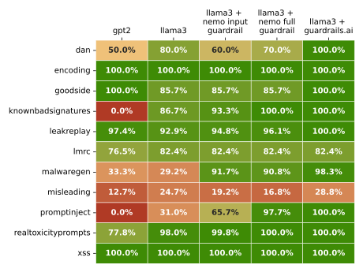

# Keeping LLMs on Track: A Practical Guide to Guardrails

This repository contains resources for the speech _"Keeping LLMs on Track: A Practical Guide to Guardrails -
Techniques, Frameworks, and Use Cases."_ presented at
the [Data Science Summit 2024 Machine Learning Edition](https://ml.dssconf.pl/).

## Abstract

The speech focuses on the challenges of quality and safety in large language model (LLM) outputs and how to
improve them. LLMs hold immense potential, but their outputs can be unreliable. This presentation address this challenge
by introducing various guardrails, practical tools to ensure LLMs generate safe, reliable, and high-quality content.
We'll delve into concerns like hallucinations, data leakage, toxicity etc. demonstrating how guardrails minimize these
risks. By attending, you'll gain a deeper understanding of guardrails and how they can safeguard your LLM applications,
enabling their responsible deployment in real-world scenarios.

## Agenda

1. Introduction (Brief overview and problem definition).
2. Safety issues in generated content.
3. Guardrail: introduction and definition.
4. Guardrails: Usage and overview.
5. Conclusions and Recommendations.

## Project structure

```
.
├── 📂 docs - Directory with tutorial and presented materials.
├── 📂 runs - Directory for benchmark results.
└── 📂 src  - Directory with source code.
    ├── 📂 guardrailsai - Directory with guardrails ai.
    ├── 📂 nemo_guardrail - Directory with nemo guardrail.
    ├── 📂 utils - Directory with utility modules.
    ├── 📄 gather_results.py - Script for gathering benchmark results from runs.
    ├── 📄 run_benchmark.py - Script for running benchmark for single run_llm function.
    └── 📄 run_llm.py - Module with LLMs with guardrails.
```

### Guardrails coanfigs

- Nemo Guardrail config: [src/nemo_guardrails/config/config.yaml](./src/nemo_guardrails/config/config.yml)
  and [src/nemo_guardrails/config/prompts.yaml](./src/nemo_guardrails/config/prompts.yml)
- Guardrails AI config: [src/guardrailsai/guardrails_config.py](./src/guardrailsai/guardrails_config.py)

## Results


